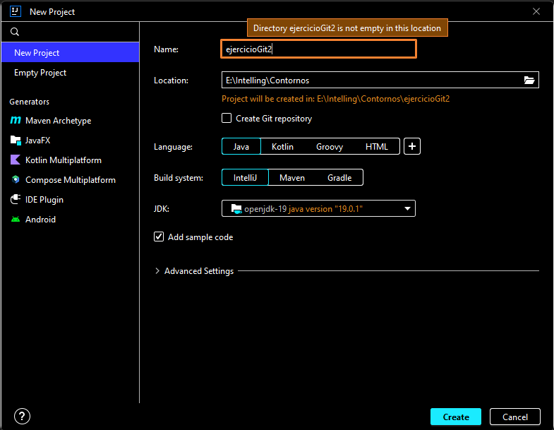

<!-- TODO: Ir completando cada punto con capturas y código -->

1. Creación de repositorio en GitHub, inicializándolo con un README.md y el .gitignore que GiHub ofrece para Java.
2. Modificación de este README.md desde GitHub para indicar lo dos primeros pasos.
3. Clono el repositorio
4. Creo un proyecto en ese directorio
5. ¡Ups! el proyecto se creó en una subcarpeta. Muevo su contenido al directorio raiz del repo.


    ```sh
     andri@Nfortec ~/e/Intelling/Contornos/ejercicioGit2 (main)
    $ git log --oneline
    a43da20 (HEAD -> main, origin/main, origin/HEAD) moviendo el proyecto a la carpeta raiz del repo
    ace5bc4 creando proyecto en intellij
    2a0337b Update README.md
    93bc712 Initial commit
   ```

   Como quiero volver a antes de crear el proyecto, tengo que hacer un reset al commit previo (5ae4948). Al hacerlo, perdería los commits posteriores, así que creo una rama nueva para ello.

   ```bas
   andri@Nfortec MINGW64 /e/Intelling/Contornos/ejercicioGit2 (main)
    $ git branch rama2

    andri@Nfortec /e/Intelling/Contornos/ejercicioGit2 (main)
    $ git checkout rama2
    Switched to branch 'rama2'
   ```

(Para crear una rama y pasar directamente a ella se podría también hacer en un paso con "git checkout -b rama2").

Ahora ya puedo hacer el reset:
```bash
andri@Nfortec /e/Intelling/Contornos/ejercicioGit2 (rama2)
$ git reset --hard 2a03
HEAD is now at  2a0337b Update README.md
   ```

y crear el proyecto directamente en el directorio donde ya está el repo.


